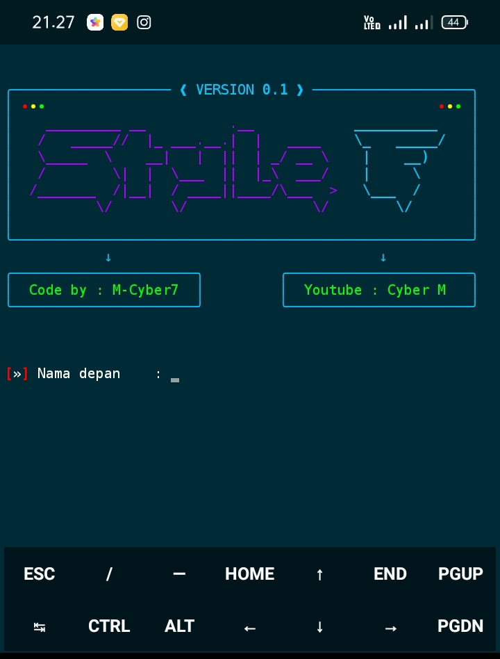

# Style_Fish 🐟🐠

#
## DESKRIPSI 🎯
* Merupakan sebuah Tools yang di rancang untuk mempermudah dan mempercepat Tugas di dalam terminal android (Termux) 🔵
* Tools ini Membutuhkan setidaknya 25.0 MB total penyimpanan!
* Dengan fungsi dan cara kerja yang hampir sama seperti KALI LINUX 🔥
* Banyak yang menganggap bahwa yang kalian gunakan adalah KALI LINUX, Nethunter! Padahal ini hanyalah sebuah Tools Ringan yang dibuat khusus untuk TERMUX.
* Tools ini menggunakan library/pustaka Python3 & fish3 dengan bantuan modul rich sebagai style Tools
* Dengan menggunakan Tools ini, anda dapat dengan mudah & cepat dalam mengeksekusi perintah/command di terminal ⚡
# PANDUAN PENGGUNA ⚠️
##### Sebelum menggunakan, pastikan anda sudah mengecek file .bashrc 
##### Coba cek file tersebut dengan perintah :
```
nano .bashrc
```
##### Jika didalam file tersebut tidak ada source/kode apapun! Maka tidak akan menjadi Masalah.
##### Namun, jika didalamnya terdapat source/kode yang pernah anda buat sebelumnya! Maka saya harap anda telah menyalin/mencopy di tempat lain!
#### Saya harap anda sudah setuju dan paham atas semua penjelasan yang saya Tulis di atas!


# PENGINSTALAN 🚀
* #### update dan upgrade Termux
```
apt update && apt upgrade -y
```
* #### Install git
```
apt install git -y
```
* #### Install Python
```
apt install python -y
```
* #### Install Modul
```
pip install rich
```
* #### Clone repository Style_F
```
git clone https://github.com/M-Cyber7/Style_Fish
```
* #### Masuk ke direktori
```
cd Style_Fish
```
* #### Jalankan Tools
```
python3 style.py
```
* #### Atau
```
Python method.py
```
#
#
### Dengan ini Anda setuju atas perubahan di file .bashrc dan config fish3. ini tidak akan mengubah/merusak sistem terminal ⛔
