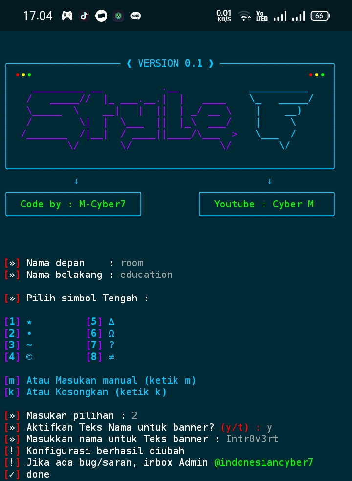
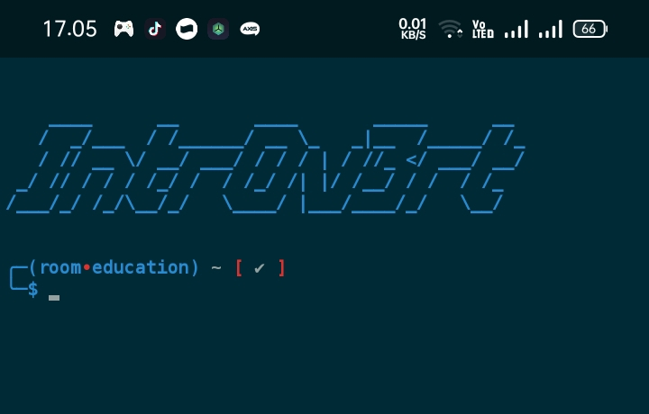
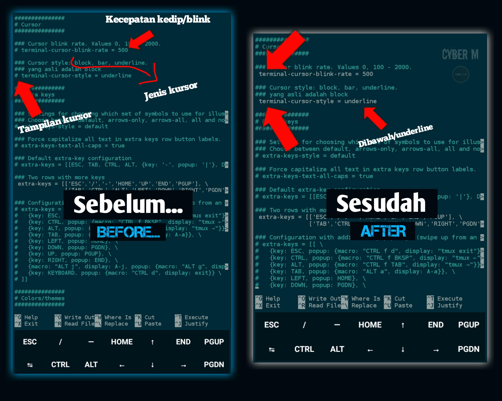
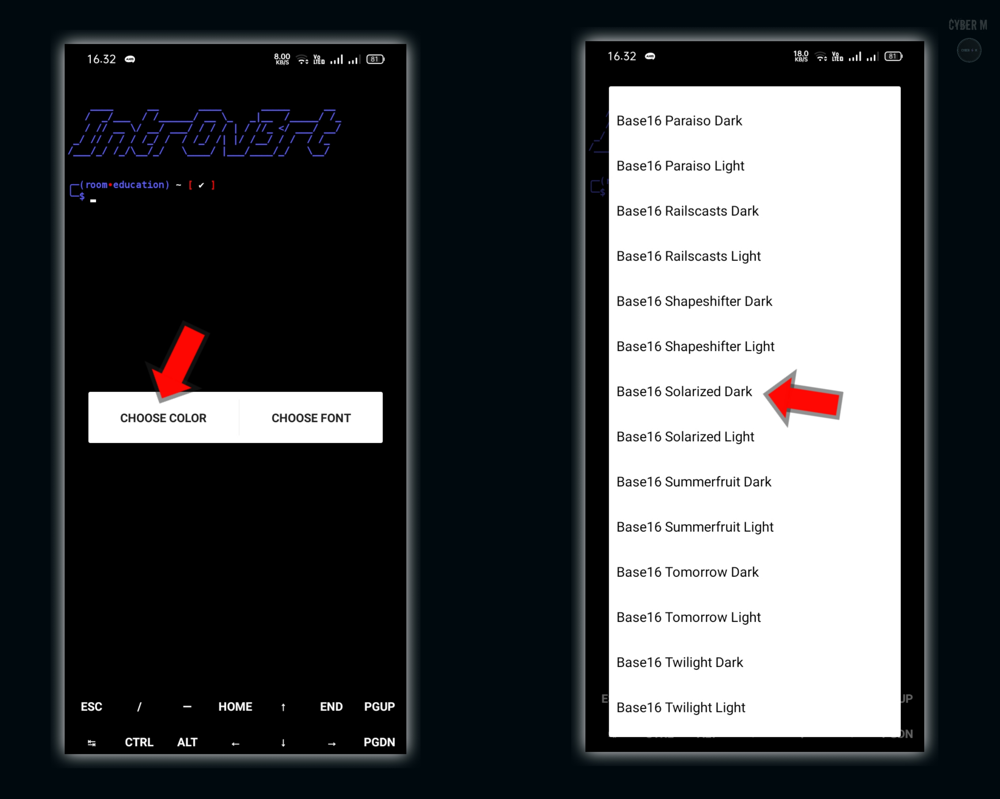

# Style_Fish 🐟🐠

#
**[🤨] If you don't understand Indonesian, you can click the three dots in the top right corner and click translate to English.**
___________________________________
#
## DAFTAR ISI
- [DESKRIPSI](#deskripsi)
- [PERINGATAN ⚠️](#peringatan)
- [PENGINSTALAN](#penginstalan)
- [ERROR](#error)
- [PENGGUNAAN](#penggunaan)
- [MENAMPILKAN KURSOR](#style-kursor)
- [WARNA BACKGROUND](#warna-style)
#
___________________________________
#
<a name="deskripsi"></a>
# DESKRIPSI 🎯
* Style_Fish Merupakan sebuah Tools yang di rancang untuk mempermudah dan mempercepat Tugas di dalam terminal android (Termux) 🔵
* Tools ini Membutuhkan setidaknya 30 MB total penyimpanan!
* Sederhana & Canggih untuk pemula!
* Dengan fungsi dan cara kerja yang hampir sama & cepat seperti KALI LINUX 🔥
* Mendukung fitur auto syntax pada Terminal/command!
* Dengan indikator pesan kesalahan khusus seperti **[ ✓ ]** Dan **[ ✘ ]**
* Tools Ringan yang dibuat khusus untuk TERMUX.
* Style_F **Version 0.5** up
* Menggunakan library/pustaka Python3 & fish3 dengan bantuan modul rich sebagai style Tools
* Mudah & cepat dalam mengeksekusi perintah/command di terminal ⚡
* Tools masih dalam tahap proses pengembangan & akan menjadi lebih baik jika anda memberikan saran kepada saya ^_^
* Tunggu update selanjutnya yang menyertakan beberapa paket perintah yang umum digunakan + mempercepat eksekusi program & kode.
#
___________________________________
<a name="peringatan"></a>
# PERINGATAN ⚠️
**Sebelum menggunakan, pastikan anda sudah mengecek file .bashrc coba cek file tersebut dengan perintah :**
```
nano .bashrc
```
Jika didalam file tersebut tidak ada source/kode apapun... Maka tidak akan menjadi Masalah. Namun, jika didalamnya terdapat source/kode yang pernah anda buat sebelumnya! Maka saya harap anda telah menyalin/mencopy di tempat lain! Saya harap anda sudah setuju dan paham atas semua penjelasan yang saya Tulis di atas!
#
___________________________________
#
<a name="penginstalan"></a>
# PENGINSTALAN 🚀
**beberapa hal yang harus anda perhatikan adalah... kesalahan saat menjalankan program!
Maka dari itu, saya harap anda sudah mengikuti hal² berikut ini!**

```
apt update && apt upgrade -y
```

```
apt install git -y
```

```
apt install python -y
```

```
apt install figlet -y
```

```
pip install rich
```

```
touch /data/data/com.termux/files/home/.config/fish/config.fish
```

```
git clone https://github.com/x7cyber/Style_Fish
```

```
cd Style_Fish
```

```
python3 style.py
```
#
___________________________________
#
<a name="error"></a>
# Error ⁉️
* Jika terjadi error, artinya anda melewati perintah untuk membuat direktori fish sebagai tempat config!
* Lakukan dengan cara ini lagi :
```
touch /data/data/com.termux/files/home/.config/fish/config.fish
```
* ini akan membuat direktori/tempat untuk menyimpan konfigurasi dari input kalian!
______________________________________
<a name="penggunaan"></a>
# PENGGUNAAN 🎯
**Contohnya :**
#

* Input Nama depan kemudian enter, dan input lagi Nama belakang. kemudian pilih simbol tengah! Jika kalian ingin memasukkan Simbol tengah secara manual Maka kalian bisa ketik **m**
* Namun jika kalian ingin meng-kosongkan simbol, maka ketik **k**
* Dan jika ingin memilih tanda/simbol yang sudah disediakan... kalian bisa pilih nomor dari angka **1** sampai **8** Yang telah disediakan seperti diatas! (Disini saya pilih nomor 2)
* Kemudian pilih opsi, apakah ingin mengaktifkan teks sebagai logo/banner ketika masuk ke dalam terminal? (y/t) :
* **y** adalah Yes sedangkan **t** adalah Tidak!
* Jika ada pertanyaan lain, anda bisa ajukan & laporkan ke admin **@indonesiancyber7**
___________________________________
#
**Seperti inilah Hasilnya :**
#

___________________________________
#
<a name="style-kursor"></a>
# MENAMPILKAN KURSOR 🖱️
**Perhatikan dengan baik... Pertama, ketiklah ```cd```**
**Kemudian masuklah ke dalam direktori khusus properti :**
```
nano ~/.termux/termux.properties
```
**Langkah awal setelah kamu masuk adalah, CARILAH TEKS dengan nama ```terminal-cursor-style =```**
Agar lebih cepat pencariannya, Tekan CTRL + W (CTRL kemudian W) lalu paste teks yang akan kita cari ```terminal-cursor-style =``` Dan kamu akan langsung diarahkan kesana!

**Langkah kedua adalah menghapus tanda ```#``` di awal teks!** Ini berfungsi untuk menyalakan konfigurasi cursor.

**Langkah ketiga Jika ingin kursor berkedip, kamu bisa atur angka dari 100-2000**

* **CONTOHNYA SEPERTI INI 👇**

#
___________________________________Jam menyiapkannya dalam bentuk MediaFire yang bisa kalian Download dengan Mudah :)

**Link Download :**
#
[](https://www.mediafire.com/file/2h200cf5iabssdk/Termux-style.apk/file)
#
**Setelah Terinstall... Pasang apk nya, dan pastikan sudah terpasang dengan baik tanpa ada kesalahan!**

Setelah itu, Masuklah ke Termux! dan **Tahan lama layar** sampai muncul teks **More** Kemudian klik dan pilih **Style**!

**Seperti ini :**

#
Kemudian pilih warna/**CHOOSE COLOR** Dan scroll ke bawah sampai kamu menemukan style bernama **Solarized Dark** 

**Seperti ini :**


#
___________________________________
#
### SELESAI 🐟🐠
#
* **Video Tutorial ⚡**
[](https://youtu.be/9hmR2JEDjGE)

* **Terimakasih telah membaca dokumentasi Tools ini 🚀**
___________________________________
#
**Find me in 🌟 :** 
#
[](https://youtube.com/@cyberm_)
[](https://github.com/x7cyber)
[](https://tiktok.com/@cyberm._)
